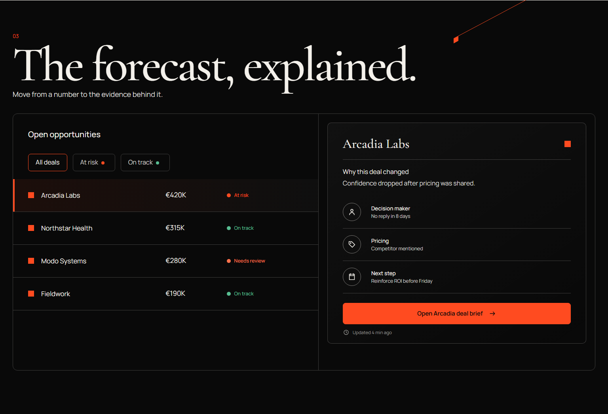

# CAIRN — Accessible Revenue Intelligence

[](https://github.com/kalil-tg/cairn-revenue-intelligence/actions/workflows/quality.yml)


CAIRN is a production-style B2B revenue-intelligence experience that turns dense pipeline data into a clear, keyboard-operable product workflow. It combines a premium editorial interface with explicit state, accessible data visualisation, responsive behaviour, and automated regression evidence.



## Product outcome

- Interactive deal pipeline with filters, selection, and an evidence panel
- Keyboard-operable tabs, dialogs, controls, and skip navigation
- Accessible chart alternative through a titled SVG and hidden data table
- Text-backed status so meaning never depends on colour alone
- Focused validation feedback and a complete request-access flow
- Reduced-motion support and mobile overflow protection

## Engineering evidence

- Five Playwright end-to-end tests
- Automated axe-core scans using WCAG 2.0, 2.1, and 2.2 A/AA tags
- A controlled legacy fixture with reproducible baseline defects
- Zero-warning ESLint gate and a strict TypeScript production build
- GitHub Actions workflow for install, lint, build, and browser tests

## Stack

React 19 · TypeScript · Vite · CSS · Playwright · axe-core

## Run locally

```bash
pnpm install
pnpm dev
```

## Verify

```bash
pnpm typecheck
pnpm lint
pnpm build
pnpm test:e2e
```

## Documentation

- [Case study](docs/CASE_STUDY.md) — problem, approach, and business value
- [Accessibility audit](docs/ACCESSIBILITY_AUDIT.md) — tested scope and evidence boundaries
- [Design system](docs/DESIGN_SYSTEM.md) — visual and interaction rules
- [Fidelity ledger](docs/FIDELITY_LEDGER.md) — implementation-to-design comparison
- [Manual QA plan](docs/MANUAL_QA_PLAN.md) — remaining assistive-technology checks

## Portfolio

[View the published CAIRN case study on Contra](https://contra.com/p/MBYNlbbk-cairn-accessible-revenue-intelligence-dashboard)

> CAIRN is a self-initiated portfolio case study for a fictional product. It is not paid client work, legal certification, or a claim of complete assistive-technology conformance.
